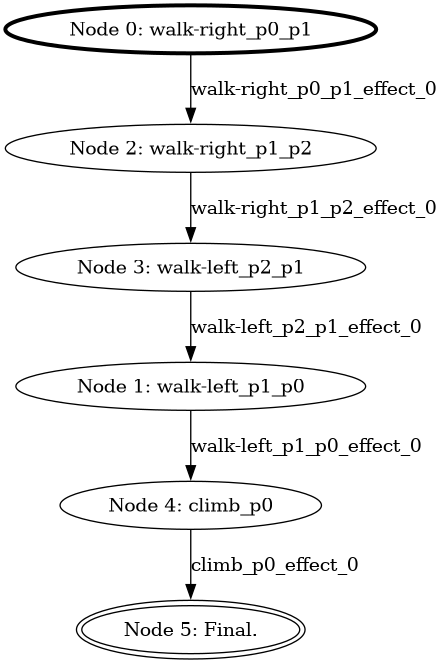
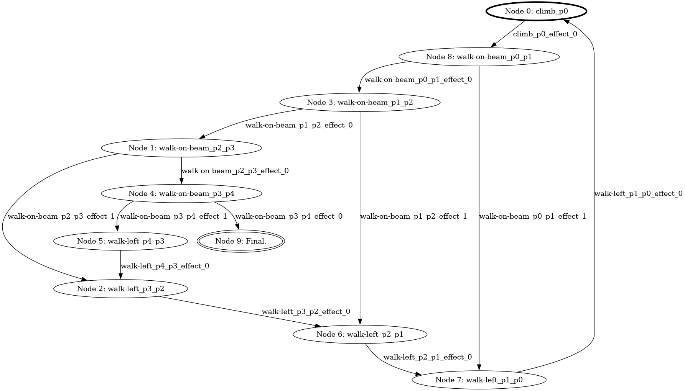

# SPGT: Small Plans for Good Times

A planner for Fully Observable Non-Deterministic (FOND) Planning domains with temporal goals specified in Pure-Past Linear Temporal Logic (PPLTL). This was produced as part of my Honours Thesis in Computer Science at the University of Sydney in 2025.

This planner is an extension of the [cfond-asp](https://github.com/ssardina-research/cfond-asp) planner, which adds support for goals specified in finite domain propositional logic and PPLTL. It is written largely in Answer Set Programming (ASP), and uses the [clingo](https://potassco.org/clingo/) ASP solver from the [Potassco collection](https://potassco.org/).

## Installation

There are two primary ways to install the planner. One can either use `pip` to install it directly from this repository:
```bash
pip install git+https://github.com/simo-bimo/spgt.git
# or
python3 -m pip install git+https://github.com/simo-bimo/spgt.git
```
Alternatively, one can first clone the repository and then install it with `pip`. This has the advantage of giving access to some of the benchmarks, and allows package to be installed as editable for development:
```bash
git clone https://github.com/simo-bimo/spgt.git
cd spgt
pip install .
# or to install as an editable package for development
pip install -e .
```
In either case, the `spgt` command is available then available in the terminal.

## Usage

The planner requires a planning domain and problem instance file, both specified in [PDDL](https://github.com/fareskalaboud/LearnPDDL). The general format is:
```bash
spgt <domain-file> <instance-file> [flags]
```
To use one of the example problems present in the repository one may run
```bash
cd spgt/benchmarks/domains/
spgt acrobatics/domain.pddl acrobatics/p01.pddl
```
The planner will then attempt to solve the given instance iteratively, by increasing the number of nodes in the controller until a solution is found. When done, there will be an `output` folder which contains two files. `instance.lp` is the translated FOND Problem in ASP. `output.lp` is the output of clingo solver, which encodes a controller in the `node/1`, `policy/2` and `next/3` ASP atoms.

To see a visual representation of the controller the planner calculates, one can add the `-gr` or `--graph` flags. This invokes [clingraph](https://potassco.org/clingraph/) to generate a graph of the resulting controller, stored in `output/graph_default.png`. The nodes are labelled with the actions they take. The initial node is bold and the final node double-lined.

There are several other flags available:

- `-td <file_name>` or `--temp_dir=<file_name>`: rename the output directory. Useful for solving many problems at once.
- `--subprocess`: invoke clingo as a subprocess rather than through the Python API. This is sometimes able to fix errors, as the CLI for clingo is more robust.
- `--clingo_path=<PATH>`: provide a path to a different ASP Solver. Note that this only takes effect if `--subprocess` is set, and that some `clingo` arguments will be passed to this solver alongside the ASP files.
- `--time_limit=x`: give up solving after `x` seconds. `x` may be a float, though it is implemented approximately as clingo only supports whole number time constraints. Forces clingo to invoke as a subprocess.
- `--start_size=n`: start iterating from `n` nodes, rather than `1`.
- `--strong`: calculate a strong, rather than a strong-cyclic, controller.
- `--ppltl`: use the PPLTL regressor and planner instead of the boolean logic one.
- `-g <formula>` or `--goal=<formula>`: used to overwrite the goal formula of the problem instance with `<formula>`.

Overwriting goals supports the following syntax to represent finite domain propositional formulae or PDDL.

- `(v = x)` the atomic statement that variable `v` takes value `x`. Use `trueValue` and `falseValue` to assign booleans.
- `!F` the negation of `F`.
- `(A&B)` the conjunction of `A` and `B`.
- `(A|B)` the disjunction of `A` and `B`. 
- `YA` yesterday `A`.
- `(ASB)` `A` since `B`.
- `(AZB)` the dual of `A` since `B`.

The dual of since is defined by:
```
( A Z B ) = !( !A S !B )
```

If you are uncertain of what variables may be present in the domain after the translation process, you may use `-g ?`, `--goal=?`, `-g TELLME` or `--goal=TELLME` to get a print out of the variables and logic symbols available in the translated domain.

When a PPLTL goal is provided the planner will automatically use the PPLTL regressor and planner programs.

## An Example Problem

As an example, we may run:
```
# pwd = spgt/benchmarks/domains/
spgt acrobatics/domain.pddl\
 acrobatics/p03.pddl\
 --graph \
 --goal="(Y(Y(Y(Y(Y(position=p0)))))&((position=p0)S(position=p1)))&(up() = trueValue)"
```
This should produce an instance similar to [this one](examples/acrobatics_p03_ppltl/instance.lp) and an output similar to [this one](examples/acrobatics_p03_ppltl/output.lp). They may not be identical, as there are multiple solutions to this planning problem. One possible graph output is as below:



Notice the controller walks from position `0` to `1`, then `2` and back to `1` then `0`, before climbing onto the beam. This means that five states ago (the initial node), the agent was in position `0`, and it has been in position `0` since it was last in position `1`, at the fourth node (confusingly labelled `Node 1` in our graph). Climbing up also makes `top()` true, and so we find the goal is satisfied.

---
We can make the goal more complicated by swapping positions `1` and `0` for some other positions. This requires the planner to climb first, `p0` is the only location with the ladder to get on the beam. Running:

```bash
spgt acrobatics/domain.pddl\
  acrobatics/p03.pddl\
  --graph\
  --goal="(Y(Y(Y(Y(Y(position=p0))))) & ((position=p4)S(position=p3)) ) & (up() = trueValue)"
```
produces the following:



This essentially amounts to climbing up the ladder, and walking along the beam to position `4`. If at any time the agent fails, it walks back to position `0` and tries again.

## Contributors

Simon Dowd - simon@anldowd.com

## Design Choices

Whenever the planner is invoked, it goes through the following essential steps:

1. Normalise the domain using the [fond-utils](https://github.com/AI-Planning/fond-utils/tree/main) library. This ensures all actions have only top-level `oneof` clauses.
2. Translate the domain into ASP and save it in `output/instance.lp`.
	- This uses a bespoke translator, as the [FastDownward](https://github.com/aibasel/downward) and [translator-fond](https://github.com/ssardina-research/translator-fond/tree/main) tools do not support temporal formulae of any kind, largely because the SAS format does not.
	- For non-temporal problems these translators should be usable. It is a future goal to add support for them.
	- The bespoke translator does basic identification of variables (for unary predicates only), and removes unchanging predicates where possible.
	- All formulae are also translated into NNF.
3. Construct the appropriate ASP Program. This will either be the PPLTL variation, optionally with additional rules to enforce a strong solution or generate the appropriate graph predicates.
4. Run clingo (or clingraph) on this program with an iteratively increasing `numNodes` parameter until a solution is found.
5. Save the output into `output/output.lp`.

The planner is sound and complete for boolean goals and preconditions. For PPLTL formulae, it is sound for both strong and strong-cyclic solutions, but only proven complete for strong solutions. We suspect it is also complete in the strong-cyclic case.